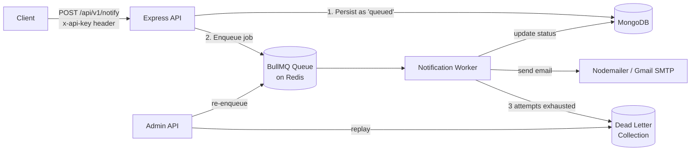

# NotifyFlow

**An async, fault-tolerant notification microservice** — built with Node.js, BullMQ, Redis, and MongoDB. NotifyFlow decouples notification dispatch from your main application flow using a producer-consumer queue architecture, with automatic retries, exponential backoff, and dead-letter recovery for jobs that fail permanently.

---

## Why NotifyFlow?

Sending emails (or any notification) synchronously inside an API request is fragile — a slow SMTP server or a transient failure shouldn't block or crash your main request-response cycle. NotifyFlow solves this by:

- Accepting a notification request instantly and returning a `202`-style response with a job ID.
- Processing the actual delivery **asynchronously** in a background worker.
- Retrying failed deliveries automatically with **exponential backoff**.
- Moving permanently-failed jobs to a **Dead Letter Queue (DLQ)** instead of losing them, with a replay mechanism to reprocess them later.

---

## Architecture



**Flow:**
1. Client hits `POST /api/v1/notify` with an API key.
2. Request passes through **auth validation** (hashed API key lookup) and **rate limiting** (Redis-backed, per-IP).
3. A `Notification` document is created in MongoDB with status `queued`, and a job is pushed onto a BullMQ queue backed by Redis.
4. A separate **worker process** consumes the queue, sends the email via Nodemailer, and updates the notification status (`processing` → `sent` / `failed`).
5. If a job exhausts all retry attempts, it's written to a **Dead Letter** collection with the failure reason and original payload — nothing is silently dropped.
6. An admin endpoint can replay a dead-lettered job, re-queuing it for another attempt.

---

## Features

- **Async job processing** with [BullMQ](https://docs.bullmq.io/) — API responses are instant; delivery happens in the background.
- **Automatic retries** — 3 attempts per job with exponential backoff (5s base delay).
- **Dead Letter Queue (DLQ)** — permanently failed jobs are persisted with their original payload and failure reason, never silently lost.
- **DLQ replay** — admin endpoint to re-queue a dead-lettered job on demand.
- **API key authentication** — keys are hashed (SHA-256) before being matched against stored client records; raw keys are never persisted.
- **Rate limiting** — Redis `INCR`/`EXPIRE`-based fixed-window limiter (5 requests/min per IP) protects the API from abuse.
- **Status tracking** — every notification's lifecycle (`queued` → `processing` → `sent`/`failed`/`dead`) is tracked in MongoDB with timestamps.
- **Centralized error handling** — consistent `ApiResponse`/`ApiErrors` shapes across the API, with an `asyncHandler` wrapper to avoid repetitive try/catch blocks.

---

## Tech Stack

| Layer | Technology |
|---|---|
| Runtime | Node.js (ESM) |
| Web framework | Express 5 |
| Queue | BullMQ |
| Queue backend | Redis (ioredis) |
| Database | MongoDB (Mongoose) |
| Email delivery | Nodemailer (Gmail SMTP) |
| Containerization | Docker |

---

## Project Structure

```
Backend/
├── src/
│   ├── controllers/
│   │   ├── notification.controller.js   # Create + enqueue notifications
│   │   └── admin.controller.js          # DLQ replay logic
│   ├── db/
│   │   ├── index.js                     # MongoDB connection
│   │   └── redis.js                     # Redis client (singleton)
│   ├── middleware/
│   │   ├── authValidator.js             # API key validation
│   │   └── rateLimiter.js               # Redis-backed rate limiting
│   ├── models/
│   │   ├── notification.model.js        # Notification schema
│   │   ├── deadLetter.model.js          # DLQ schema
│   │   └── client.model.js              # API client schema
│   ├── queues/
│   │   ├── notification.queue.js        # BullMQ queue + producer
│   │   └── notification.worker.js       # BullMQ worker (consumer)
│   ├── routes/
│   │   ├── notification.router.js
│   │   └── admin.router.js
│   ├── services/
│   │   └── mailer.service.js            # Nodemailer wrapper
│   ├── utils/
│   │   ├── ApiErrors.js
│   │   ├── ApiResponse.js
│   │   └── asyncHandler.js
│   ├── app.js                           # Express app setup
│   └── index.js                         # Server entry point
├── Dockerfile
└── package.json
```

---

## Getting Started

### Prerequisites

- Node.js 18+
- MongoDB (local or Atlas)
- Redis (local or hosted)
- A Gmail account with an [App Password](https://myaccount.google.com/apppasswords) (or swap `mailer.service.js` for another SMTP provider)

### Installation

```bash
git clone https://github.com/<your-username>/notifyflow.git
cd notifyflow/Backend
npm install
```

### Environment Variables

Create a `.env` file in the `Backend/` directory:

```env
PORT=8000
MONGODB_URL=your_mongodb_connection_string
REDIS_URL=redis://127.0.0.1:6379
CORS_ORIGINS=*
SMTP_USER=your_email@gmail.com
SMTP_PASS=your_gmail_app_password
```


### Running Locally

You need **two processes** running — the API server and the worker:

```bash
# Terminal 1 — API server
npm start

# Terminal 2 — Worker (consumes the queue)
node src/queues/notification.worker.js
```

### Running with Docker

```bash
docker build -t notifyflow .
docker run -p 8000:8000 --env-file .env notifyflow
```

> Note: the current `Dockerfile` only starts the API server. For a full setup, run the worker as a second container (or process) pointing at the same Redis/Mongo instances — see [Deployment](#deployment) below.

---

## Deployment

NotifyFlow is deployed on **[Render](https://render.com)** using the included `Dockerfile`. Render builds the image directly from the connected GitHub repo on every push — no manual `docker build`/`docker push` needed.

### Services

Because the API and the worker are separate processes, they run as **two independent Render services** off the same repo:

| Service | Type | Start Command | Purpose |
|---|---|---|---|
| `notifyflow-api` | Web Service | `npm start` (Dockerfile default `CMD`) | Handles HTTP requests, enqueues jobs |
| `notifyflow-worker` | Background Worker | `node src/queues/notification.worker.js` (overridden) | Consumes the BullMQ queue, sends emails, handles DLQ |

Both services point to the **same Dockerfile**, same repo, and share the same Redis/MongoDB instances via environment variables — only the Start Command differs for the worker service.

### Environment Variables

Set these under **Render Dashboard → your service → Environment**, not in a committed `.env` file:

```
PORT
MONGODB_URL
REDIS_URL
CORS_ORIGINS
SMTP_USER
SMTP_PASS
```

Both the API and worker services need `MONGODB_URL` and `REDIS_URL`. Only the API needs `PORT`/`CORS_ORIGINS`; only the worker needs `SMTP_USER`/`SMTP_PASS`.

### Deploy Workflow

1. Make changes locally and verify with a local Docker build (`docker build -t notifyflow . && docker run -p 8000:8000 --env-file .env notifyflow`).
2. Push to `main`.
3. If **Auto-Deploy** is enabled, Render rebuilds and redeploys both services automatically. Otherwise, trigger manually from the dashboard: **Manual Deploy → Deploy latest commit**.
4. Confirm the API is live via the health check: `GET /api/v1/check`.
5. Check the worker service logs to confirm it's connected to Redis/Mongo and consuming jobs.

### Health Check

Render pings `GET /api/v1/check` to determine if the API service is healthy before routing traffic to it.

---

## API Reference

### Health Check

```
GET /api/v1/check
```
Returns `{ success: true, message: "Backend is running" }`.

---

### Create Notification

```
POST /api/v1/notify
```

**Headers**

| Header | Required | Description |
|---|---|---|
| `x-api-key` | Yes | Client API key (validated against hashed key in DB) |
| `Content-Type` | Yes | `application/json` |

**Body**

```json
{
  "to": "user@example.com",
  "subject": "Welcome!",
  "body": "Thanks for signing up.",
  "webhookUrl": "https://yourapp.com/webhook"
}
```

`to`, `subject`, and `body` are required. `webhookUrl` is optional.

**Response — `201 Created`**

```json
{
  "statuscode": 201,
  "data": {
    "_id": "665f1c2e...",
    "jobId": "1",
    "status": "queued"
  },
  "message": "Notification successfully queued in BullMQ.",
  "success": true
}
```

**Rate limit:** 5 requests/minute per IP. Exceeding it returns `429 Too many requests`.

---

### Replay a Dead-Lettered Job

```
POST /api/v1/admin/dlq/replay/:deadLetterId
```

Re-queues a permanently-failed job for another delivery attempt and removes it from the DLQ.

**Response — `200 OK`**

```json
{
  "statuscode": 200,
  "data": {
    "originalNotificationId": "665f1c2e...",
    "newJobId": "42"
  },
  "message": "Job successfully extracted from DLQ and re-queued",
  "success": true
}
```

---

## Notification Lifecycle

```
queued → processing → sent
                    ↘ failed → (retry ×3, exponential backoff) → dead (DLQ)
```

| Status | Meaning |
|---|---|
| `queued` | Job created, waiting in the BullMQ queue |
| `processing` | Worker has picked it up and is attempting delivery |
| `sent` | Email delivered successfully |
| `failed` | A single attempt failed (will retry if attempts remain) |
| `dead` | All 3 attempts exhausted; moved to the DLQ |

---
